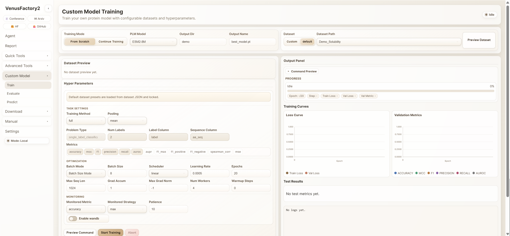
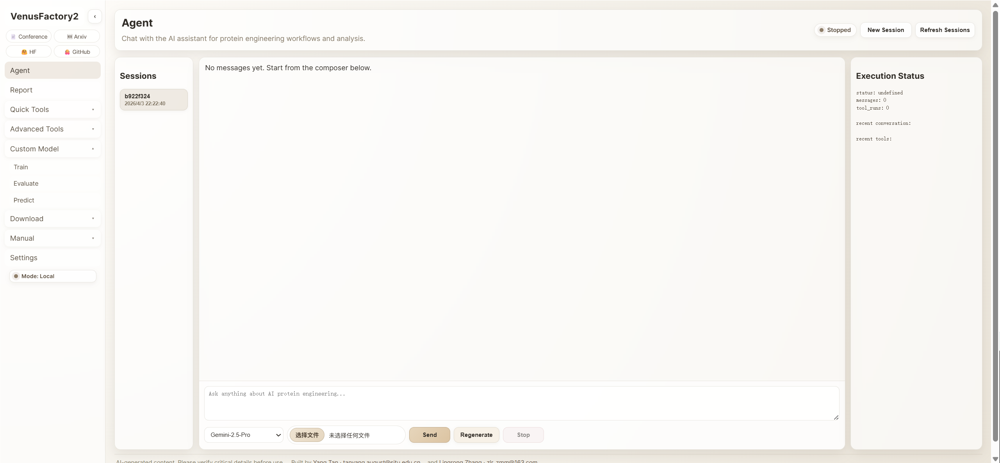
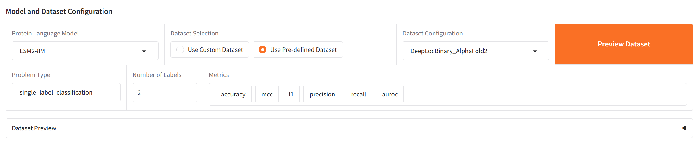
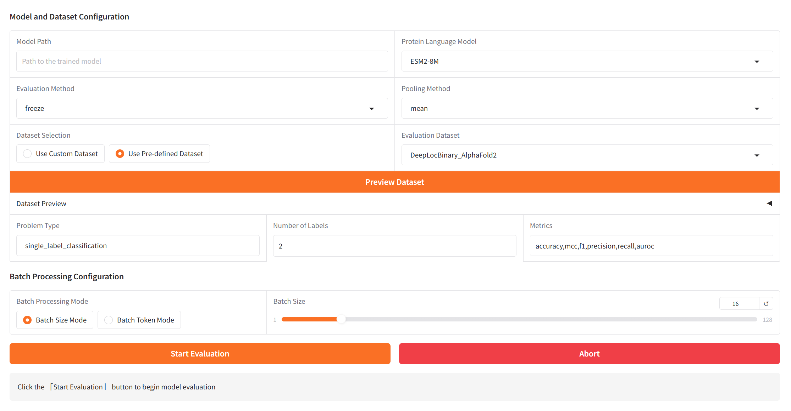
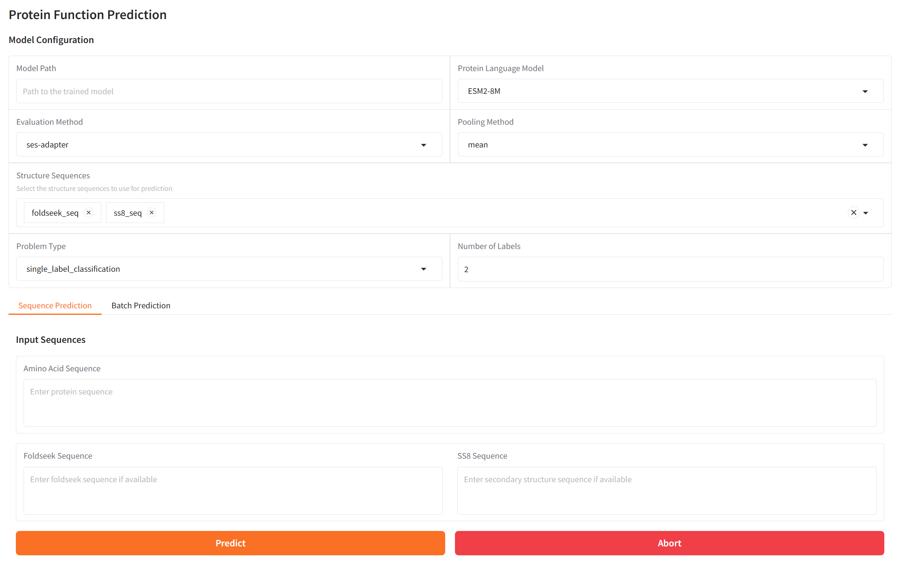

<div align="right">
  <a href="README.md">English</a> | <a href="README_CN.md">简体中文</a>
</div>

<p align="center">
  
</p>

<div align="center">

[](https://github.com/AI4Protein/VenusFactory2/stargazers) [](https://github.com/AI4Protein/VenusFactory2/network/members) [](https://github.com/AI4Protein/VenusFactory2/issues) [](https://github.com/AI4Protein/VenusFactory2/blob/main/LICENSE)

[](https://www.python.org/) [](https://venusfactory.readthedocs.io/) [](https://github.com/AI4Protein/VenusFactory2/releases) [](https://www.youtube.com/watch?v=MT6lPH5kgCc&ab_channel=BxinZhou) [](https://openbayes.com/console/public/tutorials/O3RCA0XUKa0)

**🤖 Agent驱动的蛋白质工程平台**
*一个平台，三种接口，无限可能*

</div>

---

## 🌟 最新消息

- [2026-01-23] 🚀 [VenusX](https://github.com/AI4Protein/VenusX) 新增 VenusFactory2
- [2025-08-10] 🎉 免费网站发布 [venusfactory.cn/playground](https://venusfactory.cn/playground/)
- [2025-04-19] 🎉 [VenusREM](https://github.com/ai4protein/VenusREM) 在 [ProteinGym](https://proteingym.org/benchmarks) & [VenusMutHub](https://lianglab.sjtu.edu.cn/muthub/) 排名第一！

<details>
<summary>📨 加入微信群 / 📝 分享反馈</summary>
<p align="center">
  
</p>
</details>

---

## 🎯 VenusFactory2是什么？

**VenusFactory2** 是一个**Agent驱动的蛋白质工程平台**，结合40+AI模型与11个生物数据库。为所有人设计——从生物学家到AI研究人员。

<p align="center">
  
  
  
  
</p>

<p align="center">
  
</p>

<p align="center">
  
</p>

### 🚀 为什么选择VenusFactory2？

| **🤖 Agent优先** | **🎯 三种接口** | **⚡ 从零到结果** |
|:----------------:|:--------------:|:----------------:|
| 自然语言 → 多步自动化 | Web界面 / REST API / CLI | 上传 → 秒级预测 |
| 40+模型 + 11数据库 | 相同功能，不同风格 | 或分钟级训练定制模型 |

> **📖 易于学习**：专为生命科学从业人员设计，无需编程背景即可上手。直观的Web界面、详细的中英文文档、丰富的示例和视频教程，让您快速从新手成长为蛋白质AI专家。

### 💡 核心能力一览

| 任务 | 解决方案 | 耗时 |
|:-----|:---------|:-----|
| 🧬 突变效应 | ESM-2, ProSST, ProtSSN (零样本) | <1分钟 |
| 🎯 蛋白功能 | 30+微调模型 | <30秒 |
| 🔬 定制训练 | 7种PEFT方法 (LoRA, QLoRA等) | 10-60分钟 |
| 💾 数据下载 | AlphaFold, UniProt, RCSB, KEGG等 | 实时 |
| 📚 文献研究 | AI驱动搜索与分析 | <2分钟 |

---

## ⚡ 快速开始

### 1. 安装
```bash
git clone https://github.com/AI4Protein/VenusFactory2.git && cd VenusFactory2
conda create -n venus python=3.12 && conda activate venus
pip install -r requirements.txt  # 详细指南见下方 ↓
```

### 2. 构建前端（WebUI v2 必需）
```bash
cd frontend
npm install
npm run build
cd ..
```

### 3. 启动
```bash
# Web UI v1（传统 Gradio，本地模式）
python src/webui.py --mode all  # → http://localhost:7860

# Web UI v2（FastAPI + React，本地模式）
python src/webui_v2.py --host 0.0.0.0 --port 7861  # → http://localhost:7861

# Web UI v2（FastAPI + React，在线模式）
python src/webui_v2.py --host 0.0.0.0 --port 7861 --online

# REST API
python src/api_server.py  # → http://localhost:5000/docs

# 命令行
bash script/train/train_plm_lora.sh
```

### 4. 获取结果

<details>
<summary><b>🤖 试试Agent-0.1 | ⚡ 快速工具 | 🔬 训练模型</b> (点击展开示例)</summary>

**Agent-0.1 (自然语言)**
```
问: "预测序列MKTAYIAKQRQISFV...的稳定性"
→ Agent自动选模型 → 运行预测 → 返回结果+解释
```

**快速突变评分**
```
上传: PDB/FASTA → 突变: A23V, K45R → 获得: 稳定性评分
```

**训练您的模型**
```
模型: ESM2-650M → 数据集: DeepSol → 方法: LoRA → 15分钟 → 训练完成 ✓
```

</details>

<p align="center">
  <video width="70%" controls>
    <source src="./img/venusfactory.mp4" type="video/mp4">
  </video>
</p>

---

## 🤖 Agent-0.1: 大脑

**Agent-0.1** 通过自然语言编排所有工具。基于 LangGraph + LangChain。

```
您: "为PDB:1ABC设计耐热突变"
         ↓
    🤖 Agent规划
         ↓
  📥 下载 → 🧬 预测 → 🎯 评分 → 📊 报告
  RCSB PDB  ESM-2扫描  稳定性    排序列表
```

<details>
<summary><b>✨ Agent能力</b></summary>

| 类别 | 功能 |
|:-----|:-----|
| **🔬 分析** | 突变预测 • 功能/稳定性评分 • 结构分析 |
| **💾 数据** | 多数据库搜索 • 格式转换 • 批量处理 |
| **🧠 规划** | 多步自动化 • 工具编排 • 错误处理 |
| **📚 研究** | 文献挖掘 • 家族分析 • 报告生成 |

</details>

<details>
<summary><b>💬 对话示例</b></summary>

**突变设计:**
```
您: "提高MKTAYIAKQR...的耐热性"
Agent: ✓ ESM-2扫描... ✓ 稳定性评分...
→ 前3: A5V (+2.8 kcal/mol), K9R (+1.9), T2S (+1.5)
```

**数据库搜索:**
```
您: "找分辨率<2.0Å的溶菌酶结构"
Agent: ✓ 搜索RCSB... → 找到47个结构
→ 已下载至: temp_outputs/lysozyme_structures/
```

</details>

> 💡 **注意:** 需要API密钥 (OpenAI/Anthropic)。当前Beta版本。

---

## 🏗️ 架构

```
🌐 接口: 网页界面 | REST API | CLI
        ↓
   🤖 Agent层 (LangGraph + LangChain)
        ↓
   🔧 应用层: 训练 | 评估 | 预测 | 工具
        ↓
   🛠️ 核心工具: 9大类 (突变、数据库、搜索等)
        ↓
   📊 资源: 40+模型 | 30+数据集 | 11+数据库
```

<details>
<summary><b>📚 集成资源</b></summary>

**模型(40+):** ESM, ProtBert, ProtT5, Venus/PETA/ProSST系列
**数据库(11+):** AlphaFold • RCSB PDB • UniProt • NCBI • KEGG • STRING • BRENDA • ChEMBL • HPA • FDA • Foldseek
**数据集(30+):** 功能 • 定位 • 稳定性 • 溶解度 • 突变适应度

</details>

<details>
<summary><b>🔧 工具分类</b></summary>

| 工具 | 描述 | Agent | CLI |
|:-----|:-----|:-----:|:---:|
| 🧬 突变 | ESM-1v, ESM-2, ProSST, ProtSSN, MIF-ST | ✅ | ✅ |
| 🎯 预测 | 30+微调模型 | ✅ | ✅ |
| 💾 数据库 | 11个集成 | ✅ | ✅ |
| 🔍 搜索 | PubMed, FDA, 专利 | ✅ | ✅ |
| 🏋️ 训练 | LoRA, QLoRA, DoRA等 | ✅ | ✅ |
| 📁 文件 | 格式转换 | ✅ | ✅ |
| 🔬 Denovo | 蛋白设计 | ✅ | ✅ |
| 🧪 发现 | 新蛋白发现 | ✅ | ✅ |
| 📊 可视化 | 3D查看器 | ✅ | ✅ |

</details>

---

## 🧬 支持的模型

<details>
<summary><b>40+ 蛋白质语言模型</b> (点击展开)</summary>

**Venus系列 (Liang课题组):**
ProSST-20/128/512/1024/2048/4096 (110M) • ProPrime-690M • VenusPLM-300M • PETA-base/bpe/unigram (80M)

**ESM系列 (Meta AI):**
ESM2: 8M, 35M, 150M, 650M, 3B, 15B • ESM-1v: 5个模型 (650M)

**ProtBert & ProtT5:**
ProtBert-Uniref100/BFD (420M) • IgBert (420M) • ProtT5-XL/XXL (3B-11B) • Ankh-base/large (450M-1.2B)

**选择指南:**
- GPU <8GB: ESM2-8M/35M, ProSST
- GPU 8-16GB: ESM2-150M/650M, ProtBert
- GPU 24GB+: ESM2-3B, ProtT5-XL
- 多GPU: ESM2-15B, ProtT5-XXL

**按任务:**
- 分类: ESM2, ProtBert
- 结构: Ankh
- 生成: ProtT5
- 抗体: IgBert/IgT5
- 轻量: ProSST, PETA

</details>

---

## 📚 支持的数据集

<details>
<summary><b>30+ 监督 + 零样本数据集</b></summary>

**零样本:** VenusMutHub • ProteinGym (217 DMS)

**功能:** EC • GO_BP • GO_CC • GO_MF
**定位:** DeepLocBinary • DeepLocMulti • DeepLoc2Multi
**稳定性:** Thermostability • TAPE_Stability
**溶解度:** DeepSol • DeepSoluE • eSOL • ProtSolM • PETA_CHS/LGK/TEM_Sol
**突变:** FLIP_AAV (7个拆分) • FLIP_GB1 (5个拆分) • TAPE_Fluorescence
**其他:** DeepET_Topt • MetalIonBinding • SortingSignal • PaCRISPR

所有数据集可在 [HuggingFace](https://huggingface.co/AI4Protein) 获取

</details>

---

## 📦 安装

<details>
<summary><b>🍎 macOS (M1/M2/M3)</b></summary>

```bash
git clone https://github.com/AI4Protein/VenusFactory2.git && cd VenusFactory2
conda create -n venus python=3.12 && conda activate venus
pip install --pre torch torchvision torchaudio --extra-index-url https://download.pytorch.org/whl/nightly/cpu
pip install torch_scatter torch-sparse torch-geometric -f https://data.pyg.org/whl/torch-2.8.0+cpu.html
pip install -r requirements_for_macOS.txt
```

</details>

<details>
<summary><b>🪟 Windows / 🐧 Linux (CUDA 12.8)</b></summary>

```bash
git clone https://github.com/AI4Protein/VenusFactory2.git && cd VenusFactory2
conda create -n venus python=3.12 && conda activate venus
pip install torch==2.8.0 torchvision --index-url https://download.pytorch.org/whl/cu128
pip install torch_geometric
pip install pyg_lib torch_scatter torch_sparse torch_cluster torch_spline_conv -f https://data.pyg.org/whl/torch-2.8.0+cu128.html
pip install -r requirements.txt
```

</details>

<details>
<summary><b>🪟 Windows / 🐧 Linux (CUDA 11.8)</b></summary>

```bash
git clone https://github.com/AI4Protein/VenusFactory2.git && cd VenusFactory2
conda create -n venus python=3.12 && conda activate venus
pip install torch==2.7.0 --index-url https://download.pytorch.org/whl/cu118
pip install torch_geometric
pip install pyg_lib torch_scatter torch_sparse torch_cluster torch_spline_conv -f https://data.pyg.org/whl/torch-2.7.0+cu118.html
pip install -r requirements.txt
```

</details>

<details>
<summary><b>💻 仅CPU</b></summary>

```bash
git clone https://github.com/AI4Protein/VenusFactory2.git && cd VenusFactory2
conda create -n venus python=3.12 && conda activate venus
pip install torch torchvision --index-url https://download.pytorch.org/whl/cpu
pip install torch_geometric
pip install pyg_lib torch_scatter torch_sparse torch_cluster torch_spline_conv -f https://data.pyg.org/whl/torch-2.8.0+cpu.html
pip install -r requirements.txt
```

</details>

**验证:** `python -c "import torch; print(torch.__version__)"`

---

## 🚀 使用方法

### 网页界面

> WebUI v2 在生产模式下会从 `frontend/dist` 提供静态资源，因此启动 `src/webui_v2.py` 前请先在 `frontend/` 中执行 `npm run build`。

```bash
# 先构建 WebUI v2 前端资源
cd frontend && npm run build && cd ..

# v1（传统 Gradio）- 本地模式
python src/webui.py --mode all  # → http://localhost:7860

# v1（传统 Gradio）- 在线兼容模式（功能受限）
WEBUI_V2_MODE=online python src/webui.py --mode all  # → http://localhost:7860

# v2（FastAPI + React）- 本地模式
python src/webui_v2.py --host 0.0.0.0 --port 7861  # → http://localhost:7861

# v2（FastAPI + React）- 在线模式
python src/webui_v2.py --host 0.0.0.0 --port 7861 --online  # → http://localhost:7861
```

| 标签页 | 用途 | 功能 |
|:-------|:-----|:-----|
| **训练** | 训练定制模型 | 模型选择 • PEFT方法 • 实时监控 • Wandb |
| **评估** | 基准测试 | 加载模型 • 选择指标 • CSV导出 |
| **预测** | 推理 | 单个/批量预测 • 结果可视化 |
| **Agent** | 自然语言 | 多步自动化 • 工具编排 |
| **快速工具** | 快速预测 | 突变评分 • 功能预测 |
| **高级工具** | 深度分析 | 序列/结构模型 |
| **下载** | 数据检索 | AlphaFold • UniProt • RCSB • InterPro |
| **手册** | 文档 | 指南与教程 |

<details>
<summary><b>截图</b></summary>





</details>

### CLI & API

<details>
<summary><b>命令行示例</b></summary>

```bash
# 训练模型
bash script/train/train_plm_lora.sh \
  --model facebook/esm2_t33_650M_UR50D \
  --dataset DeepSol --batch_size 32

# 评估
bash script/eval/eval.sh \
  --model_path ckpt/DeepSol/best_model \
  --test_dataset DeepSol

# 下载数据
bash script/tools/database/alphafold/download_alphafold_structure.sh
bash script/tools/database/uniprot/download_uniprot_seq.sh

# 生成结构序列
bash script/get_structure_seq/get_esm3_structure_seq.sh
```

</details>

<details>
<summary><b>REST API示例</b></summary>

```bash
# 启动服务器
python src/api_server.py  # → http://localhost:5000/docs

# 突变预测
curl -X POST http://localhost:5000/api/mutation/predict \
  -H "Content-Type: application/json" \
  -d '{"sequence": "MKTAYIA...", "mutations": ["A23V", "K45R"]}'

# 功能预测
curl -X POST http://localhost:5000/api/predict/function \
  -H "Content-Type: application/json" \
  -d '{"sequence": "MKTAYIA...", "tasks": ["solubility", "stability"]}'

# 数据库搜索
curl http://localhost:5000/api/database/uniprot/search?query=lysozyme&limit=10
```

</details>

<details>
<summary><b>Python API</b></summary>

```python
from src.tools.mutation import predict_mutation_effects
from src.tools.predict import predict_protein_function
from src.tools.database import download_alphafold_structure

# 突变
results = predict_mutation_effects(
    sequence="MKTAYIAKQR...",
    mutations=["A5V", "K9R"],
    model="esm2"
)

# 功能
predictions = predict_protein_function(
    sequence="MKTAYIA...",
    tasks=["solubility", "stability"]
)

# 数据
pdb_file = download_alphafold_structure("P12345")
```

</details>

---

## 📊 训练方法

| 方法 | 内存 | 速度 | 性能 | 最适合 |
|:-----|:----:|:----:|:----:|:-------|
| **LoRA** | 低 | 快 | 良好 | 通用任务 |
| **QLoRA** | 非常低 | 慢 | 良好 | GPU有限 |
| **DoRA** | 低 | 中 | 更好 | LoRA改进 |
| **AdaLoRA** | 低 | 中 | 更好 | 自适应秩 |
| **SES-Adapter** | 中 | 中 | 更好 | 选择性调优 |
| **IA3** | 非常低 | 快 | 良好 | 轻量级 |
| **Freeze** | 低 | 快 | 良好 | 简单调优 |

---

## 🙌 引用

```bibtex
@inproceedings{tan2025venusfactory,
  title={VenusFactory: An Integrated System for Protein Engineering with Data Retrieval and Language Model Fine-Tuning},
  author={Tan, Yang and Liu, Chen and Gao, Jingyuan and Banghao, Wu and Li, Mingchen and Wang, Ruilin and Zhang, Lingrong and Yu, Huiqun and Fan, Guisheng and Hong, Liang and others},
  booktitle={Proceedings of the 63rd Annual Meeting of the Association for Computational Linguistics (Volume 3: System Demonstrations)},
  pages={230--241},
  year={2025}
}
```

---

## 🎊 致谢

由上海交通大学 [Liang's Lab](https://ins.sjtu.edu.cn/people/lhong/index.html) 开发和维护。

**资源:** [文档](https://venusfactory.readthedocs.io/) • [YouTube](https://www.youtube.com/watch?v=MT6lPH5kgCc&ab_channel=BxinZhou) • [在线试用](https://venusfactory.cn/playground/) • [Issues](https://github.com/AI4Protein/VenusFactory2/issues)

---

<div align="center">

**为蛋白质工程社区用❤️制作**

[⭐ 加星](https://github.com/AI4Protein/VenusFactory2) • [🐛 报告Bug](https://github.com/AI4Protein/VenusFactory2/issues) • [💡 功能建议](https://github.com/AI4Protein/VenusFactory2/issues)

</div>
